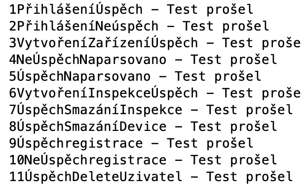

# Semestrální práce - Zdravotechnika

## Měl bys vědět
uživatel `pavel:pavel` - admin práva a uživatel `jakub_stepanek:pavel` s normálními právy. Každý další uživatel má pouze uživatelská práva.

některé příkazy např. add, show, delete vyžadují argument. Ukázka

```
  show 19 // 19 signalizuje den v kalendáři
  delete 3 // 3 signlaizuje id
  show 3 // také signalizuje id
```


## Abstrakt
Aplikace má sloužit jako elegantní řešení pro **evidenci** zdravotechniky a přístrojů (monitory, ventilátory, RTG, laboratorní přístroje, a jiné…).

Aplikace zprostředkovává přehled přístrojů s **výpisem základních parametrů.**
Systém eviduje kromě základních evidenčních údajů i **data závislá na čase** jako je příslušnost k nákladovým střediskům, stav zařízení, údaje o revizích, kalibracích, BTK, metrologii atd. Každá z položek má vazbu na spotřební materiál, který se u ní používá - infuzní sety, hadice, roztoky, spotřební sady atd. 

**Cílem** je kompletně podchytit správu zdravotechniky a 
**zjednodušit procesy** její údržby, spotřebního materiálu a služeb a zároveň poskytnout precizní přehled o hospodaření a provozních nákladech na jednotlivých nákladových střediscích v reálném čase.

## Význam práce 
Projekt by měl napodobovat (a pokusit se vylepšit datový model) jeden z modulů (**Zdravotechnika**) pro nemocniční informační systém (NiS, napsán v _ObjectScriptu od InterSystems_ a _Node.Js_), na kterém se podílím. 
- Vyzkoušení práce s knihovnou pro mysql v Javě pro evidenci položek. 
- Vyzkoušení jak udržet stav o přihlášeném uživateli v konzoli. 
- Pokusit se držet nějakého design patternu při vývoji

## Funkční specifikace
Některé funkcionality fungují pouze pro uživatelé s **administrátorskými právy**
### 1. Users
* Přihlásit se
* Registrovat se 
* Změnit heslo
* Exportovat do binárního souboru
* Přečíst z bínárního souboru
* Odhlásit se
### 2. Kalendář
* Další měsíc, předchozí měsíc, dnes
* Přidat inspekci
* Importovat ze souboru
### 3. Inspekce
* Smazat 
* Přidat
* Označit za hotové
### 4. Zdravotechnická zařízení
* Přidat
* Zobrazit
* Exportovat
* Smazat

## Popis řešení
Cílem bylo co nejvíce oddělit logiku od zobrazovací vrstvy. Aplikace je rozdělena do několika vrstev. Do datové vrstvy, servisní a prezenční. K tomu jsou ještě nějaké pomocné utility (Db, Menu, IO, ...). 

Jediný kdo komunikuje s databází, která se nachází na serveru (pavel-vacha.cz) je datová vrstva **Repository** přes databázový wrapper. Tyto data zpracovává pouze servisní vrstva **Service** a o tyto data si žádá **View**. (Proto se nejdná o MVC. V MVC View dostane data naservírované už od kontroleru a View generuje eventy na které kontroler reaguje).

Základem všech pohledu je abstraktní třída **View**, která má v sobě `display()` a `showMessage()`

O routování mezi View se stará třída **Navigator**. Má v sobě jakýsi zásobník a na základě zavolané metody se s ním pracuje... Více v kódu..

O výpis menu (i s korektně ošetřenými právy) se stará třída *Menu*

Databázový wrapper má vytvořený pool připojení a dynamicky je přidává a ubírá dokud není vyčerpáná interně zvolená kapacita. (Nebo server nepřestane odpovídat :)). Na serveru běží `10.3.27-MariaDB-0+deb10u1 - Debian 10`. Schéma lze najít níže


## Databázové schéma

  

## Formát souborů

Vstupní soubor pro inspekci. Formát **.txt** první řádek jsou hlavičky a další soubory jsou oddělené mezerou. Datum musí být ve formátu **(dd/mm/yyyy)**

```
idDevice    idInspection    supplier        inspectionDate
3           2               Altier          25/5/2022
3           3               Caviar          26/5/2022
3           1               Savo            13/5/2022
```

Výstupní formát předmětů ze zdravotechniky. V hlavičce je ID, interní registrovací čísel, název a typ zařízení z číselníku. Vše je odděleno tabama. (Data se již neimportují zpět)
```
ID    IRN           NAME                  CPV_DEVICE_TYPE
4     X-2321011     Rentegonový přístroj  Radiodiagnostické doplnňky(33124210-0)
```

V profilu jsem využil exportu a importu do binárního souboru, abych splnil požadavky :). Formát:

```
    1. int - ID uživatele
    2. utf - jméno uživatele
    3. utf - heslo uživatele (zahashované)
    4. boolean - je admin?
```

## Class diagram 


## Testování
Zdrojový kód k testům najdete v `package com.tul.vacha.semestralproject.ui.ConsoleApp;`. Otestoval jsem několik základních CRUD operací, limitních stavů a chybně zadaných vstupů od uživatele.



## Popis fungování externí knihovny

MySQL connector poskytuje připojení klientské aplikace v Jave k  MySQL a zastřešuje Java Database Connectivity (JDBC) API

Použití:

```java
import java.sql.*;
class MysqlCon {

    public static void main(String args[]) {

        try {
            Class.forName("com.mysql.jdbc.Driver");
            Connection con = DriverManager.getConnection("jdbc:mysql://localhost:3306/sonoo", "root", "root");

            //here sonoo is database name, root is username and password  
            Statement stmt = con.createStatement();
            ResultSet rs = stmt.executeQuery("select * from emp");

            while (rs.next())
                System.out.println(rs.getInt(1) + "  " + rs.getString(2) + "  " + rs.

                    getString(3));
            con.close();
        } catch (SQLException e) {
            System.out.println(e);
        }
    }
}
```
## ResultSetPropertiesSimplifyHelps

Dále bylo využito jakési knihovničky ResultSetPropertiesSimplifyHelps, která by měla být schopna automaticky mapovat ResultSet z JDBC do javovských objektů.

Po mírném zásahu a opravách v knihovně to bylo možné. Knihovnu jsem dále nezkoumal, je možné, že by mohla být i nebezpečná -> deserializace objektu všeobecně je nebezpečná, když je udělaná špatně.